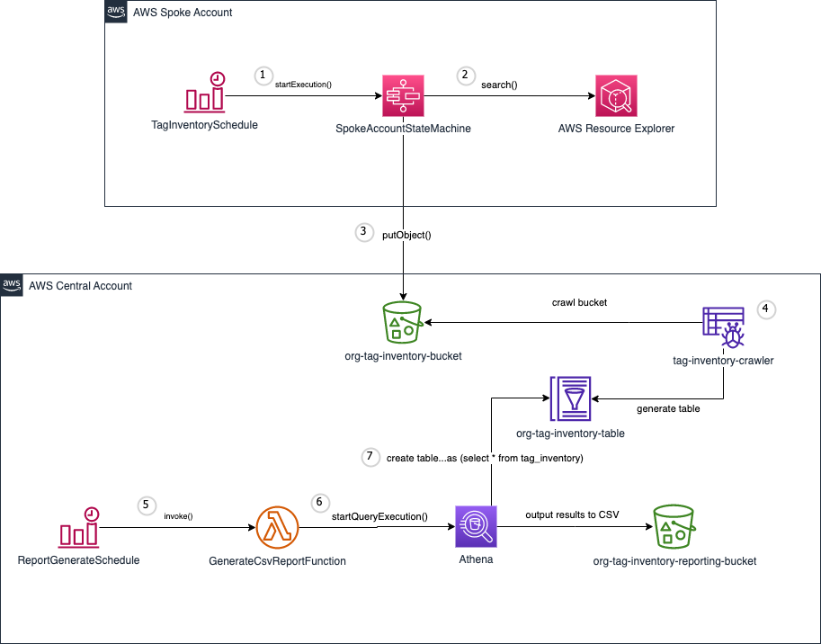
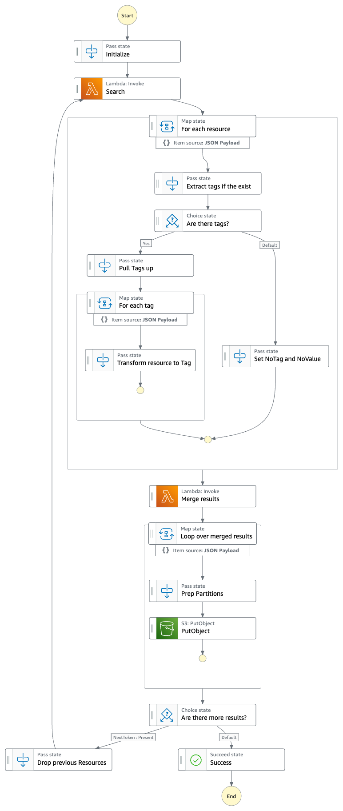
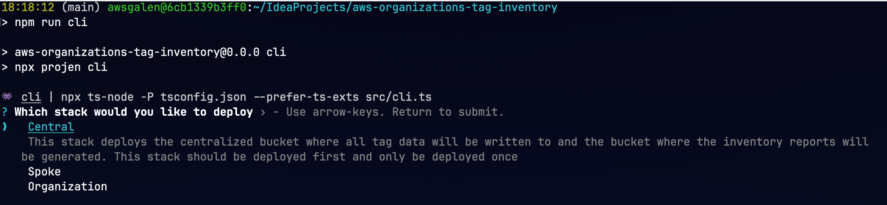
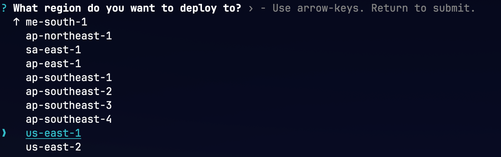
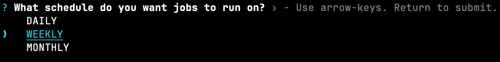
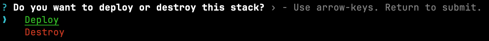

# aws-organizations-tag-inventory

This cdk project is an example of how a customer can generate a report on what tags exist and the resources they are applied to across their entire AWS organization.


## Architecture



The solution consists of one central account and one to many spoke accounts. 

1. Spoke accounts have an [Amazon EventBridge Scheduler](https://docs.aws.amazon.com/eventbridge/latest/userguide/scheduler.html) 
which periodically triggers an [AWS Step Functions](https://docs.aws.amazon.com/step-functions/latest/dg/welcome.html) state machine, [SpokeAccountStateMachine](#spoke-account-state-machine). 
2. This state machine queries all resources across all regions within the account using [AWS Resource Explorer](https://aws.amazon.com/resourceexplorer/). 
3. The state machine processes and transforms the results and writes them to an [S3 bucket](https://docs.aws.amazon.com/AmazonS3/latest/userguide//Welcome.html) in the central account.
4. Within the central account there is a Glue Crawler that will periodically crawl the S3 bucket where the results land and generate a table in the Glue data catalog.
5. There is another Amazon EventBridge Scheduler in the central account which periodically triggers the [GenerateCsvReportFunction](./src/functions/GenerateReportCSV.ts) [AWS Lambda](https://docs.aws.amazon.com/lambda/latest/dg/welcome.html) function. 
6. Using Athena, this function executes the following statement.

```sql
CREATE TABLE "<DATABASE>"."tag_inventory_csv" WITH (
    format = 'TEXTFILE',
    field_delimiter = ',',
    external_location = 's3://<REPORT_BUCKET>/<LATEST_DATE>',
    bucketed_by = ARRAY [ 'd' ],
    bucket_count = 1
) AS 
(
    SELECT 
        d,
        tagname,
        tagvalue,
        r.owningAccountId,
        r.region,
        r.service,
        r.resourceType,
        r.arn
    FROM 
        "<DATABASE>"."<TAG_INVENTORY_TABLE>",
        unnest("resources") as t ("r")
    where 
        d = (select max(d) from "<DATABASE>"."<TAG_INVENTORY_TABLE>")
);
```  
7. Athena creates the table in the Glue data catalog which generates a file in the reporting bucket in S3
8. Once complete the GenerateCsvReportFunction will rename the report file and delete the table from the Glue data catalog.


## Spoke Account State Machine
Below is the state machine diagram that is run in each spoke account to gather and process tag inventory 


## Deployment
### Prerequisites

* All accounts (central and spoke) need to be part of the same [AWS Organization](https://docs.aws.amazon.com/organizations/latest/userguide/orgs_introduction.html)
* Install [nodejs](https://nodejs.org/en/download)
* Install the [AWS CLI](https://docs.aws.amazon.com/cli/latest/userguide/getting-started-install.html)
* `npm install -g aws-cdk` - Install the [AWS CDK Tooklkit](https://docs.aws.amazon.com/cdk/v2/guide/cli.html)
* Be sure to have [AWS credentials available on your terminal](https://docs.aws.amazon.com/cli/latest/userguide/cli-chap-authentication.html)


## Deployment
The easiest way to deploy the solution is using the supplied command line interface (cli) 

> [!NOTE]
> The Resource Explorer API is not available in all AWS regions. Check for availability via the [AWS console](https://resource-explorer.console.aws.amazon.com/resource-explorer/home) before deploying.

### Deploy central stack
1. Open a terminal on your local machine, 
1. Ensure there are  [AWS credentials available on your terminal](https://docs.aws.amazon.com/cli/latest/userguide/cli-chap-authentication.html) for the account that you want to deploy the central stack to.
1. Checkout the project from GitHub by running `git clone https://github.com/aws-samples/aws-organizations-tag-inventory.git`
1. `cd` into the project directory `cd aws-organizations-tag-inventory`
1. Install dependencies `npm install`
1. Run the cli tool `npm run cli`  select "Central" and follow the prompts
   
2. Select the region you want to deploy the resources to
   
2. Select the frequency you want to generate the report
   
3. Choose whether you want to deploy the QuickSight dashboard to visualize your tag data
   
   1. If you choose to deploy the [QuickSight dashboard](#quicksight-dashboard) you'll be asked to select the users and groups that can access the dashboard
      
> [!NOTE]
> You **MUST** have the Enterprise Edition of Quicksight to use this feature
      
10. Select whether you want to "Deploy" or "Destroy" this stack
    
3. Confirm your choices
   
1. Copy the output values for "**CentralStackNotificationTopicArnOutput**", "**CentralStackPutTagInventoryRoleOutput**", and "**OrganizationsTagInventoryBucketNameOutput**", you'll need these values later
   

Once the central stack is deployed you can [subscribe to notifications](https://docs.aws.amazon.com/sns/latest/dg/sns-create-subscribe-endpoint-to-topic.html) delivered through the deployed SNS topic. 

###  Deploy a single spoke stack
If you would like to deploy just a single spoke stack follow the directions below. However, if you would like to deploy the spoke stack to **multiple** account across your 
AWS organization jump to [Deploy multiple spoke stacks using Cloudformation StackSets](#deploy-multiple-spoke-stacks-using-cloudformation-stacksets)

1. Open a terminal on your local machine,
1. Ensure there are  [AWS credentials available on your terminal](https://docs.aws.amazon.com/cli/latest/userguide/cli-chap-authentication.html) for the account that you want to deploy the spoke stack to.
3. Checkout the project from GitHub by running `git clone https://github.com/aws-samples/aws-organizations-tag-inventory.git`
4. `cd` into the project directory `cd aws-organizations-tag-inventory`
5. Install dependencies `npm install`
6. Run the cli tool `npm run cli`  select "Spoke" and follow the prompts
   
7. Select the region you want to deploy the resources to
   
2. Select the frequency you want to gather tag inventory
   
8. Enter the central bucket name from [Deploy central stack - Step 12](#deploy-central-stack)
   
8. Enter the central topic arn from [Deploy central stack - Step 12](#deploy-central-stack)
   
9. Enter the arn of the central cross account role from [Deploy central stack - Step 12](#deploy-central-stack)
   
10. Select the region that you want to setup AWS Resource Explorer indexes in
   
11. Select the region that you want to setup the AWS Resource Explorer aggregator index in
   
11. Select whether you want to "Deploy" or "Destroy" this stack
    
11. Confirm your choices
   
### Deploy multiple spoke stacks using Cloudformation StackSets
Before you can deploy multiple spoke stacks using [stacksets](https://docs.aws.amazon.com/AWSCloudFormation/latest/UserGuide/what-is-cfnstacksets.html) be sure to [activate trusted access with AWS Organizations](https://docs.aws.amazon.com/AWSCloudFormation/latest/UserGuide/stacksets-orgs-activate-trusted-access.html) 

1. Open a terminal on your local machine,
1. Ensure there are  [AWS credentials available on your terminal](https://docs.aws.amazon.com/cli/latest/userguide/cli-chap-authentication.html) for the **payer** account for your AWS organization.
3. Checkout the project from GitHub by running `git clone https://github.com/aws-samples/aws-organizations-tag-inventory.git`
4. `cd` into the project directory `cd aws-organizations-tag-inventory`
5. Install dependencies `npm install`
6. Run the cli tool `npm run cli`  select "Organization" and follow the prompts
   
7. Select the region you want to deploy the resources to
   
2. Select the frequency you want to gather tag inventory and generate the report 
   
8. Enter the central bucket name from [Deploy central stack - Step 12](#deploy-central-stack)
   
8. Enter the central topic arn from [Deploy central stack - Step 12](#deploy-central-stack)
   
9. Enter the arn of the central cross account role from [Deploy central stack - Step 12](#deploy-central-stack)
   
10. Select the region that you want to setup AWS Resource Explorer indexes in
    
11. Select the region that you want to setup the AWS Resource Explorer aggregator index in
    
12. Select the organizational unit(s). The spoke stack will be deployed to accounts within these OUs. Choose the 'Root' OU if you want to gather tag inventory from all accounts int the organization.
    
11. Select whether you want to "Deploy" or "Destroy" the stacks for the organization
    
14. Confirm your choices
   

### QuickSight Dashboard
The optionally deployed QuickSight dashboard currently shows several example visualizations


### Removal Policies

For the purpose of this example the removal policy for all S3 buckets has been configured as **DESTROY**.  This means that when the resource is removed from the app, 
it will be physically destroyed.

### A note on service quotas

If you have alot of resources in an account and/or you run the reports daily you may exceed the "[Aggregator Region search monthly quota](https://console.aws.amazon.com/servicequotas/home/services/resource-explorer-2/quotas/L-A28429E9)" limit. 
This limit can be increased via [Service Quotas](https://console.aws.amazon.com/servicequotas/home/). 

### A note on AWS Resource Explorer Search API limitations

Per the [Search API documentation](https://docs.aws.amazon.com/resource-explorer/latest/apireference/API_Search.html#API_Search_RequestParameters) 

> The operation can return only the first 1,000 results. If the resource you want is not included, then use a different value for QueryString to refine the results.

This means that if there are more than 1000 resources in the spoke account, only the first 1000 will be returned. 
