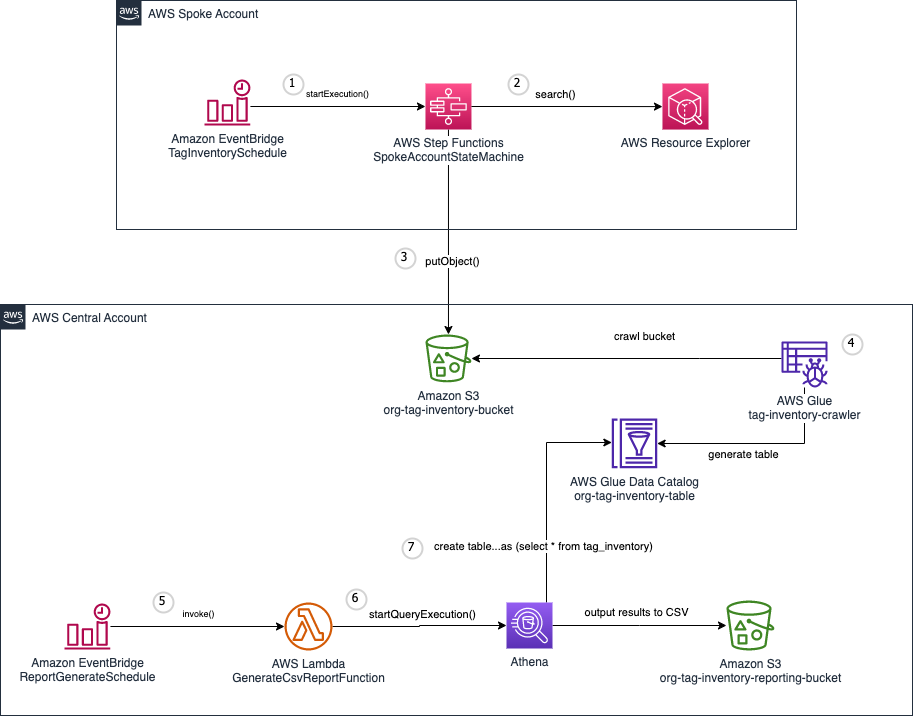

# aws-organizations-tag-inventory

This cdk project is an example of how a customer can generate a report on what tags exist and the resources they are applied to across their entire AWS organization.


## Architecture



The solution consists of one central account and one to many spoke accounts. 

1. Spoke accounts have an [Amazon EventBridge Scheduler](https://docs.aws.amazon.com/eventbridge/latest/userguide/scheduler.html) 
which periodically triggers an [AWS Step Functions](https://docs.aws.amazon.com/step-functions/latest/dg/welcome.html) state machine, [SpokeAccountStateMachine](#spoke-account-state-machine). 
2. This state machine queries all resources across all regions within the account using [AWS Resource Explorer](https://aws.amazon.com/resourceexplorer/). 
3. The state machine processes and transforms the results and writes them to an [S3 bucket](https://docs.aws.amazon.com/AmazonS3/latest/userguide//Welcome.html) in the central account.
4. Within the central account there is a Glue Crawler that will periodically crawl the S3 bucket where the results land and generate a table in the Glue data catalog.
5. There is another Amazon EventBridge Scheduler in the central account which periodically triggers the [GenerateCsvReportFunction](./src/functions/GenerateReportCSV.ts) [AWS Lambda](https://docs.aws.amazon.com/lambda/latest/dg/welcome.html) function. 
6. Using Athena, this function executes the following statement.

```sql
CREATE TABLE "<DATABASE>"."tag_inventory_csv" WITH (
    format = 'TEXTFILE',
    field_delimiter = ',',
    external_location = 's3://<REPORT_BUCKET>/<LATEST_DATE>',
    bucketed_by = ARRAY [ 'd' ],
    bucket_count = 1
) AS 
(
    SELECT 
        d,
        tagname,
        tagvalue,
        r.owningAccountId,
        r.region,
        r.service,
        r.resourceType,
        r.arn
    FROM 
        "<DATABASE>"."<TAG_INVENTORY_TABLE>",
        unnest("resources") as t ("r")
    where 
        d = (select max(d) from "<DATABASE>"."<TAG_INVENTORY_TABLE>")
);
```  
7. Athena creates the table in the Glue data catalog which generates a file in the reporting bucket in S3
8. Once complete the GenerateCsvReportFunction will rename the report file and delete the table from the Glue data catalog.


## Spoke Account State Machine
Below is the state machine diagram that is run in each spoke account to gather and process tag inventory 


## Deployment
### Prerequisites

* All accounts (central and spoke) need to be part of the same [AWS Organization](https://docs.aws.amazon.com/organizations/latest/userguide/orgs_introduction.html)
* Install [nodejs](https://nodejs.org/en/download)
* Install the [AWS CLI](https://docs.aws.amazon.com/cli/latest/userguide/getting-started-install.html)
* `npm install -g aws-cdk` - Install the [AWS CDK Tooklkit](https://docs.aws.amazon.com/cdk/v2/guide/cli.html)
* Be sure to have [AWS credentials available on your terminal](https://docs.aws.amazon.com/cli/latest/userguide/cli-chap-authentication.html)

ℹ️ **Note**: If you are running from the [AWS CloudShell](https://docs.aws.amazon.com/cloudshell/latest/userguide/welcome.html) you can skip the prerequisites section
## Deployment
The easiest way to deploy the solution is using the supplied command line interface (cli) through the [AWS CloudShell](https://docs.aws.amazon.com/cloudshell/latest/userguide/welcome.html)

### Deploy central stack
1. Login to the AWS Console in the account you want to use for centralized reporting of tag inventory.
2. Open the AWS CloudShell
3. Checkout the project from GitHub by running `git clone https://github.com/aws-samples/aws-organizations-tag-inventory.git`
4. `cd` into the project directory `cd aws-organizations-tag-inventory`
5. Install dependencies `npm install`
6. Run the cli tool `npm run cli`  select "central" and follow the prompts 
7. Copy the output values for  "**CentralStackPutTagInventoryRoleOutput**" and "**OrganizationsTagInventoryBucketNameOutput**"


###  Deploy a single spoke stack
If you would like to deploy just a single spoke stack follow the directions below, if you would like to deploy the spoke stack to multiple account across your 
AWS organization jump to [Deploy multiple spoke stacks using Cloudformation StackSets](#deploy-multiple-spoke-stacks-using-cloudformation-stacksets)

1. Login to the AWS Console in the account you want to use for centralized reporting of tag inventory.
2. Open the AWS CloudShell
3. Checkout the project from GitHub by running `git clone https://github.com/aws-samples/aws-organizations-tag-inventory.git`
4. `cd` into the project directory `cd aws-organizations-tag-inventory`
5. Install dependencies `npm install`
6. Run the cli tool `npm run cli`  select "spoke" and follow the prompts 

### Deploy multiple spoke stacks using Cloudformation StackSets
Before you can deploy multiple spoke stacks using stackets be sure to [activate trusted access with AWS Organizations](https://docs.aws.amazon.com/AWSCloudFormation/latest/UserGuide/stacksets-orgs-activate-trusted-access.html) 

1. Login to the AWS Console in the payer account for your AWS Organization.
2. Open the AWS CloudShell
3. Checkout the project from GitHub by running `git clone https://github.com/aws-samples/aws-organizations-tag-inventory.git`
4. `cd` into the project directory `cd aws-organizations-tag-inventory`
5. Install dependencies `npm install`
6. Run the cli tool `npm run cli`  select "organization" and follow the prompts 

### Removal Policies

For the purpose of this example the removal policy for all S3 buckets has been configured as **DESTROY**.  This means that when the resource is removed from the app, 
it will be physically destroyed.
